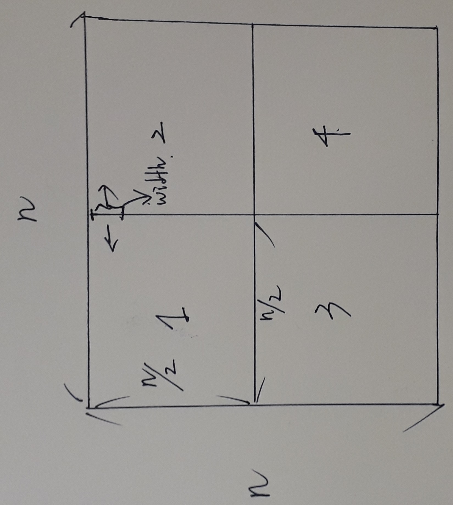
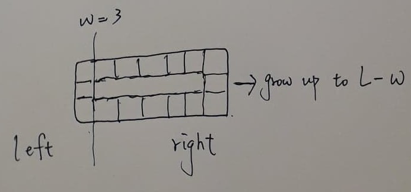

## HW1 b05202068

### Problem 5 - Time Complexity & Recurrence

#####(1) Asymptotic Notations

(a) For $n$ in  $[\frac{5}{6}\pi, \pi]$, $0 \leq sin(n) \leq \frac{1}{2} \rightarrow 0 \leq n^{sin(n)} \leq \sqrt{n}$. Therefore, $\sqrt{n}$ is not bounded by  $O(n^{sin(n)})$.

(b) 
$$
f(n) = \Theta (g(n)) \iff \exists n_{0}, c_{1}, c_{2} \hspace{0.1cm} s.t. c_{1}g(n) \leq f(n) \leq c_{2}g(n)  \hspace{0.2cm} \forall n \geq n_{0}
$$ 

To prove $log(f(n)) = \Theta(log(g(n)))$, since $f(n)$ and  $g(n)$ are increasing and non-negiative,  $c_{1}g(n) \leq f(n) \leq c_{2}g(n) \rightarrow log(g(n)) \leq log(c_{1}g(n)) \leq log(f(n)) \leq log(c_{2}g(n)) = log(c_{2}) + log(g(n))$, for all $n \geq n_{0}$. So $log(f(n))$ is tighly bounded by $log(g(n))$.

(c)

Given 
$$
f_{1}(n) = O(g_{1}(n)) \iff \exists n_{0}, c_{1} \forall n \geq n_{0} \hspace{0.2cm} f_{1}(n) \leq c_{1}g_{1}(n)\\
f_{2}(n) = O(g_{2}(n)) \iff \exists n^{\prime}_{0}, c_{2} \forall n \geq n_{0} \hspace{0.2cm} f_{2}(n) \leq c_{2}g_{2}(n)\\

$$, 
prove
$$
 f_{1}(f_{2}(n)) = O(g_{1}(g_{2}(n))) \iff \exists n^{\prime \prime}_{0}, c^{\prime \prime}, K \forall n \geq n^{\prime \prime}_{0} f_{1}(f_{2}(n)) \leq c^{\prime \prime} g_{1}(Kg_{2}(n))
$$.

If $min\{f_{2}(n), n\} \geq n_{0}$, then 
$$f_{1}(f_{2}(n)) \leq c_{1}g_{1}(f_{2}(n)) \underbrace{\leq}_{g_{1}: increasing}  c_{1}g_{1}(c_{2}g_{2}(n))$$

Thus, $n_{0}^{\prime \prime} = n_{0}$, $c^{\prime \prime} = c_{1}$, $K = c_{2}$.

(d)

$$
\exists n_{0}, c_{1}, c_{2}, K \forall n\geq n_{0} \hspace{0.3cm} c_{2}n^{b} + K \leq (n+a)^{b} \leq c_{2}n^{b}
$$ 

We have, for $b \gt 0$,
$$
n^{b} + a^{b} \leq (n+a)^{b} = n^{b} + C^{b}_{1}n^{b-1}a + ... +C^{b}_{b}a^{b} \leq n^{b} + n^{b}a^{b}\sum^{b}_{i=1}C^{b}_{i} = \Big( (2^{b} - 1)a^{b} + 1\Big)n^{b}
$$
Hence, $c_{1} = 1$, $K = a^{b}$, and $c_{2} = (2^{b} - 1)a^{b} + 1$

 ##### (2) Solve Recurrence

(a)

$$
T(n) = T(n - 127) + \frac{127}{log(n)} = T(n - 127k) + 127\underbrace{\big( \frac{1}{log(n)} + ... +\frac{1}{log(n - 127k)}\big)}_\text{k+1 terms  } 
$$ 

With $n - 127k = 2 \rightarrow k = \frac{n-2}{127}$, since $\frac{1}{log(x) - 1} \leq \frac{127}{log(x)}$,

$$
 \frac{\frac{n-2}{127} + 1}{log(n) - 1} \leq \frac{1}{log(n) - 1} + ... + \frac{1}{log(2) - 1} \leq T(n)
$$.

Also, since $ \frac{1}{log(x)} = \frac{log(x)}{log^{2}(x)} \leq \frac{127\big(log(n) - 1\big)}{log^{2}(n)}$, thus

$$
T(n) \leq 127^{2}\big(\frac{log(n) - 1}{log^{2}(n)} + ... + \frac{log(2) - 2}{log^{2}(2)}\big) \leq 127^{2} \int_{2}^{n} \frac{log(x) - 1}{log^{2}(x)} = 127^{2}\frac{x}{log(x)}\Bigg|_{2}^{n} = \frac{127^{2}n}{log(n)}
$$ 

So, $T(n) = \Theta(\frac{n}{log(n)})$

(b)

$$
T(n) = T(\frac{n}{2}) + T(\frac{n}{4}) + T(\frac{n}{8}) + nlog(n)\\
=  nlog(n) + \frac{n}{2}log(\frac{n}{2}) + \frac{n}{2^{2}}log(\frac{n}{2^{2}}) + \frac{n}{2^{3}}log(\frac{n}{2^{3}}) + ...
$$ 

With $\frac{n}{2^{k}} = 1 \rightarrow k = log_{2}(n)$

$$
T(n) \leq nlog(n)\Big(1 + \frac{7}{8} + ... + \big(\frac{7}{8}\big)^{k}\Big) - n \Big(\frac{7}{8}log(2) +... + \big(\frac{7}{8}\big)^{k}log(2^{k})\Big) \\

=nlog(n)\Big(8 - 7\big(\frac{7}{8}\big)^{k}\Big) - 56log(2)n\Big(\big(\frac{7}{8}\big)^{k}(-\frac{1}{8}k - 1) + 1\Big) = 8nlog(n) + 56log(2)n^{1 + log_{2}^{\frac{7}{8}}} = O(nlog(n))
$$ 

Also, 
$$
O(nlog(n))  = nlog(n) \sum_{i = 0}^{k} \big(\frac{7}{8}\big)^{i}\leq T(n)
$$ 

Thus, $T(n) = \Theta(nlog(n))$

(c) $T(n) = 4T(\frac{n}{2}) +nlog(n) = 16T(\frac{n}{4}) + 4 \frac{n}{2}log(\frac{n}{2}) + nlog(n) = \sum_{i=1}^{log_{2}n} 2^{2i} \frac{n}{2^{i}} log(\frac{n}{2^{i}})$.

Thus,

$$
T(n) = \sum_{i=1}^{log_{2}n} 2^{i}n(log(n) - log2^{i}) = \frac{2^{1+log_{2}n} - 1}{2 - 1}nlog(n) - nlog(2)\big( (2 log_{2}(n) - 2)n + 2\big) 
$$ 
$ = 2log(2)n^{2} - 2nlog(2) + n^{2}log(n)\big(2- 2\big) - nlog(n)= \Theta(n^{2}) $.

The term $n^{2}log(n)$ vanishes. The result is consistent with the master theorem ($n^{log_{2}(4)}$ grows faster than $nlog(n)$).

Here, with $k = log_{2}(n)$, I used 
$$
\sum_{i=0}^{k} x^{i} = \frac{x^{k+1} - 1}{x - 1} = f(x) \\
\rightarrow \sum_{i=1}^{k} ix^{i} =xf^{\prime}(x) =  x\frac{kx^{k+1} - (k+1)x^{k} + 1}{(x-1)^{2}}\\
\sum_{i=1}^{k} i 2^{i} = (2k - 2)2^{k} + 2
$$ 

(d) 
$$
T(n) = n^{\frac{1}{2}}T(n^{\frac{1}{2}}) + n = n^{\frac{1}{2}}\big(n^{\frac{1}{4}}T(n^{\frac{1}{4}}) + n^{\frac{1}{2}} \big) + n 
= n^{\frac{1}{2} + \frac{1}{4} + ... +\frac{1}{2^{k}}} T(n^{\frac{1}{2^{k}}}) + kn\\
T(n) = n^{1 - 2(\frac{1}{2^{k+1}})} + kn = 2n + \big(log_{2}(log(n)) - 1\big)n = \Theta(nlog(log(n)))
$$ 

When $T(n^{\frac{1}{2^{k}}}) = 1$, $n^{\frac{1}{2^{k}}} = 2 \rightarrow k = log_{2}(log(n)) - 1$

### Problem 6 - Viennese Waltz

#### (1)
First let $A(i, j)$ be the total weights of the rectangular region denoted by $(0,0)$ and  $(i, j)$($i$-th row and $j$-th column) and $w(i,j)$ be the weight at  $(i,j)$

We can compute a table of the total weights at each grids in time $O(n^{2})$ by using:
$$
A(i, j) = \begin{cases}
w(0,0), & i=0, j=0\\
w(i,0) + A(i-1,0), & i\geq 1, j= 0\\
w(0, j) + A(0, j-1), & i = 0, j \geq 1\\
w(i, j) + A(i-1, j) + A(i, j-1) - A(i-1, j-1), & i \geq 1 , j \geq 1
\end{cases}
$$ 

Now for the $k$ given rectangles, each with upper left $a = (i_{a}, j_{b})$ and lower right $b = (i_{b}, j_{b})$, their weights of the rectangular perimeters can be computed in $O(k)$ by using  the summed area table $A(i,j)$.

The weights $P$ on the rectangular perimeter is equal to the rectangle weights $A_{1}$ over  $(i_{a}, j_{a})$ and $(i_{b}, j_{b})$ minus the rectangle weights $A_{2}$ over $(i_{a}+1, j_{a}+1)$ and $(i_{b}-1, j_{b}-1)$, which can be done in $O(1)$.

$$
P = A_{1} - A_{2}\\
A_{1} = A(i_{b}, j_{b}) - A(i_{b}, j_{a} - 1) - A(i_{a}-1, j_{b}) + A(i_{a}-1, j_{a}-1)\\
A_{2} = A(i_{b}-1, j_{b}-1) - A(i_{b}-1, j_{a}) - A(i_{a}, j_{b}-1) + A(i_{a}, j_{a})\\
$$ 

#### (2) 
To exhaust every rectangle in the $n\times n$ grids, we have to choose two distinct grids  $a$ and  $b$. This takes $\underbrace{n(n-1)}_\text{pick two rows}\times \underbrace{n(n-1)}_\text{pick two columns} = O(n^{4})$ because for each grid we choose the row index and column index.

Then for each grid-pair $(a,b)$, we can compute the perimeter $l(a,b)$ and the weights of the rectangle in $O(1)$ according to the table and the relation $P = A_{1}-A_{2}$in (1). Pick the maximum weight with perimeter no greater than $L$ while exhausting every choice.

#### (3)
* Discuss with 劉安浚

We can  divide-and-conquer the grids. First, divide the $n\times n$ grids into four regions, each of size $\frac{n}{2}\times \frac{n}{2}$. The maximum rectangle weights will be either in the maximum from one of the four regions, or the four cross cases.

We have to find the maximum among the cross cases($1\&2$,  $1\&3$, $3\&4$, $2\&4$, and  $1\&2\&3\&4$ ).

 Take $1\&2$ for example, for each rectangle with width of $w$, we can compute the maximum weight respectively in left and right in time $O(n)$ with the use of the summed area table($O(1)$ compute of each rectangle). (The maximum weight of a rectangle must contain two maximums in both sides, which is similar to maximum subarray problem)

 Now the number of choices for different widths $2 ,..., \frac{n}{2}$ can be $\frac{n}{2}-1, ..., 1$ respectively. In total, there $1+ ...+(\frac{n}{2}-1) = \frac{n}{4}(\frac{n}{2}-1) = O(n^{2})$.  Thus in this case, the time complexity is $O(n^{3})$.

 The cases of crossing over two regions are similar. For the case crossing four regions, observe that we can pick $l$ from left side and $r$ from right side as the range, then find the maximum in upper and lower regions in time $O(n)$. The number of choices for different ranges are $\underbrace{\frac{n}{2}}_\text{left}\times \underbrace{\frac{n}{2}}_\text{right} = O(n^{2})$. Hence, $O(n^{3})$ in time.

$$
T(n) = 
\begin{cases}
1 &, n=1\\
 4T(\frac{n}{2}) + O(n^{3})&, n \gt 1\\
\end{cases} \rightarrow T(n) = O(n^{3})
$$ 
#### (4) 
* Discuss with 廖晨皓

Using the same divide-and-conquer method in (3), except we have to make sure that, during cross cases, the total perimerters from two sides won't be greater than $L$. 

For each width $w$, we can first maintain an array  $arr[l]$ that store the left weights ( $l = L-w$ ).Each entry $arr[i]$ is the maximum weight among those from the perimeter at middle to perimeter  $i$ .This takes $O(\frac{n}{2})$ to complete. 

Now we start to add every right rectangle-weights of perimeters $j$ to $arr[l-j]$. Then we try to memorize the maximum until the right reaches at most  $\frac{n}{2}$.  This takes also $O(\frac{n}{2})$ to find the maximum weight.

Thus, the finding of maximum sub-rectangle weight for each width takes  $O(n)$. The number of different widths are $O(n^{2})$.

This maximum-searching applies to any case($1\&2$,  $1\&3$, $3\&4$, $2\&4$, and  $1\&2\&3\&4$ ). For the cross case over four regions, we also select left and right grids ($O(n^{2}$) as width and for each width run the $O(n)$ maximum-searching with  $L$-constraint for upper and lower regions like above.

Thus the time complexity is $O(n^{3})$.
